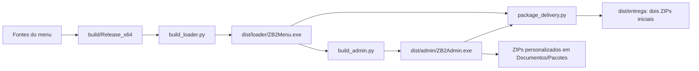

# Arquitetura e manutenção do DEADBLOCK

## Três coisas diferentes

| Pasta | Função | Quem usa |
|---|---|---|
| D:/Projeto/ZB2 Menu | Código, dependências, compilações e entregas | Desenvolvedores |
| dist/admin e dist/loader | Executáveis atuais | Proprietário, equipe e clientes |
| Documentos/ZB2Menu | Estado pessoal e componentes extraídos | Cada usuário no próprio PC |

Apagar Documentos não desinstala somente o programa. Pode apagar a licença do
cliente, o perfil emissor, a chave da estação, o histórico e as configurações.

## Caminho de uma entrega

O Admin incorpora o cliente compilado. Por isso, se o loader mudar, o Admin deve
ser recompilado depois dele. Se apenas a ajuda ou o gerenciamento do Admin mudar,
o loader e o runtime do jogo podem manter suas versões.

## O que existe em build/Release_x64

Esta é uma saída técnica do Visual Studio, não a pasta que deve ser enviada a alguém.
Na revisão havia oito arquivos:

| Arquivo | Papel | Tratamento |
|---|---|---|
| Deadblock.Menu.dll | Módulo nativo do menu e hook D3D11 | Necessário para montar o cliente |
| Zb2.AimBridge.dll | Ponte gerenciada com Unity Mono | Necessário para montar o cliente |
| 0Harmony.dll | Dependência gerenciada | Necessário para montar o cliente |
| config.ini | Configuração inicial do runtime | Necessário para montar o cliente |
| Harmony.LICENSE | Atribuição da dependência distribuída | Preservar com a dependência |
| injector.exe | Helper de uma compilação anterior do menu | Não é escolhido por build_loader.py, que recompila seu helper |
| Deadblock.Menu.pdb | Símbolos de depuração dessa DLL | Preservar para investigar falhas; não entra no pacote do cliente |
| Deadblock.Menu.map | Mapa de endereços dessa compilação | Preservar para investigar falhas; não entra no pacote do cliente |

`packaging/runtime-files.json` declara os sete componentes incorporados no cliente.
O helper `injector.exe` e `ZB2.Readiness.dll` são construídos em `build/loader`.
Os demais vêm da saída do runtime. PDB e MAP ficam fora desse manifesto.

Não renomear a DLL só para melhorar sua aparência na pasta: projetos, carregamento,
manifestos, logs e testes referenciam esses nomes. A marca apresentada ao usuário é
DEADBLOCK; os nomes técnicos preservam compatibilidade. O cliente recebe um ZIP
pequeno com o executável e, no pacote ativado, a licença. Ele não recebe Release_x64.

## Mapa do código

| Local | Responsabilidade |
|---|---|
| src/menu/main.cpp, mono.cpp, gui.cpp e módulos .inl/.h dessa pasta | Inicialização do menu, acesso ao jogo e interface interna |
| managed/ e scripts/build_managed_aim.py | Código gerenciado e compilação da ponte |
| injector/ | Helper nativo usado pelo carregador |
| apps/loader/controller.cpp | Estados e execução do cliente |
| apps/loader/license.cpp | Validação das licenças e identificação do dispositivo |
| apps/loader/services.cpp | Serviços de carregamento e componentes do pacote |
| apps/loader/readiness* | Verificação de disponibilidade da partida |
| apps/admin/native/ui.cpp | Telas e ações do painel |
| apps/admin/native/main.cpp | Janela, arquivos, configurações e integração das ações |
| apps/admin/native/backend.cpp | Comunicação local com o serviço por pipes |
| apps/admin/Backend.cs | Comandos de emissão, autorização e pacotes |
| apps/admin/Core.cs | Assinaturas, chave protegida e histórico |
| apps/admin/Packages.cs | ZIP inicial, ZIP ativado e ZIP da equipe |
| apps/admin/native/settings.cpp | Preferências, diagnóstico e limpeza segura do serviço antigo |
| apps/shared/ | Tipografia, controles, gráficos, recursos e marca |
| packaging/ | Chave pública e manifesto de componentes |
| scripts/ e tests/ | Compilação, empacotamento e verificações |
| docs/ e memory/ | Guias de produto e conhecimento técnico |

## Dados que precisam ser preservados

- `Admin/station.json`: perfil e chave protegida da estação emissora.
- `Admin/licenses` e autorizações: histórico de clientes e equipe.
- `loader/license.dat`: ativação local do cliente.
- `configs`, `imgui.ini` e preferências: configuração pessoal.
- `Pacotes`: arquivos que o operador escolheu salvar para enviar.
- `.local/private` e `.local/backups` no projeto: emissão e recuperação do proprietário.

`Admin/runtime` contém o serviço extraído do próprio executável. Versões antigas
podem ser limpas pela ferramenta do Admin. `loader/runtime` contém componentes do
jogo e não é incluído nessa limpeza: uma DLL ainda pode estar carregada no processo.

## Política de limpeza

Configurações oferece **Analisar resíduos** e, após a análise, **Limpar analisados**.
Só entram serviços antigos do Admin cujo conteúdo corresponde ao hash da pasta.
A limpeza preserva o serviço atual, arquivos em uso, conteúdo alterado, pastas com
arquivos desconhecidos e caminhos redirecionados. Não percorre outros diretórios.
Nada é apagado ao abrir o painel ou clicar apenas em Analisar.

O inventário anterior cobriu todos os arquivos das duas raízes, incluindo dependências
e Git. Isso não significa que cada linha de todo o código foi revisada. A classificação
e os 25 arquivos removidos estão em `.local/audits/2026-09-30-cleanup`.

## Próximos passos de qualidade

1. Manter builds reproduzíveis, hashes, versão e testes associados a cada entrega.
2. Formalizar assinatura Authenticode e identificação do publicador quando houver
   certificado ou serviço de assinatura disponível.
3. Analisar cada alerta pelo arquivo, hash e nome da detecção. Não prometer ausência
   de detecção, desativar a proteção ou mudar código só para esconder comportamento.
4. Preservar símbolos de cada runtime publicado para diagnosticar falhas.
5. Fazer backup controlado da estação e testar recuperação, sem incluir esse backup nos ZIPs.

Consulte também ADMIN.md, ATUALIZACOES.md, BRAND.md e ANTIVIRUS.md.

Organização atual: fontes nativos em `src/menu/`. Consulte [DESENVOLVIMENTO.md](DESENVOLVIMENTO.md).
