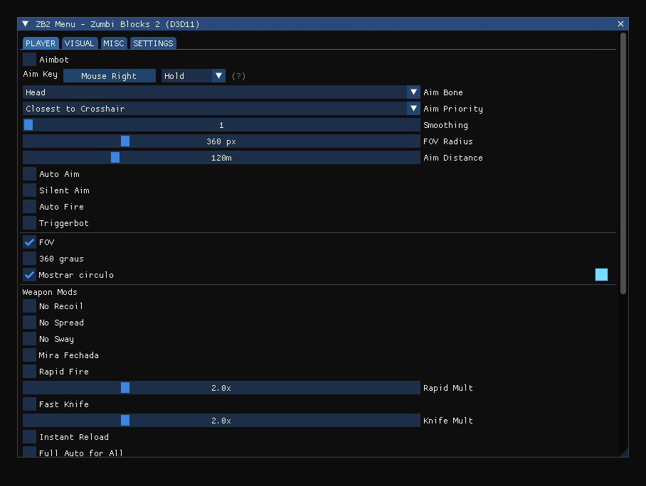
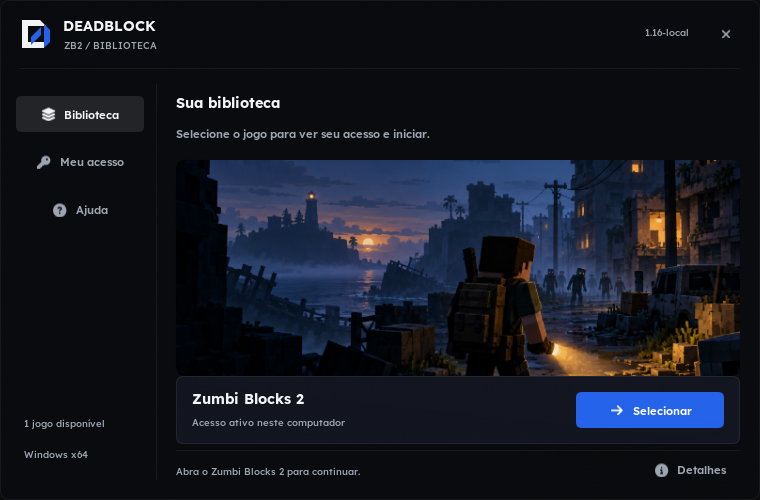
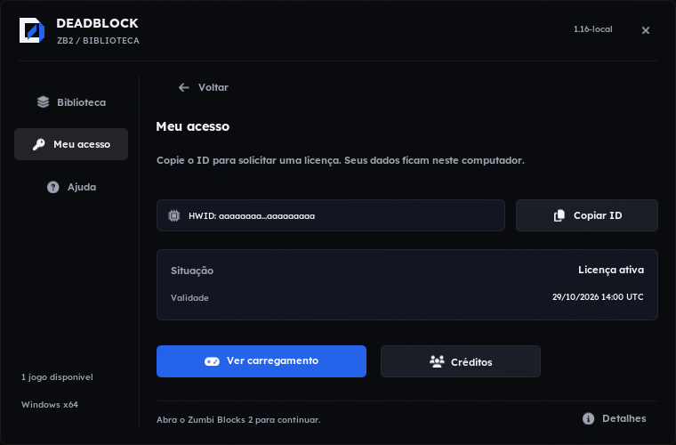
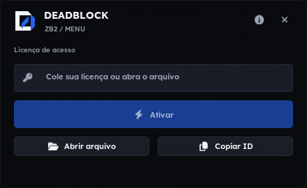
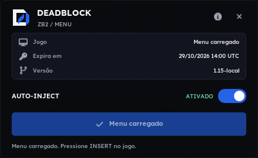
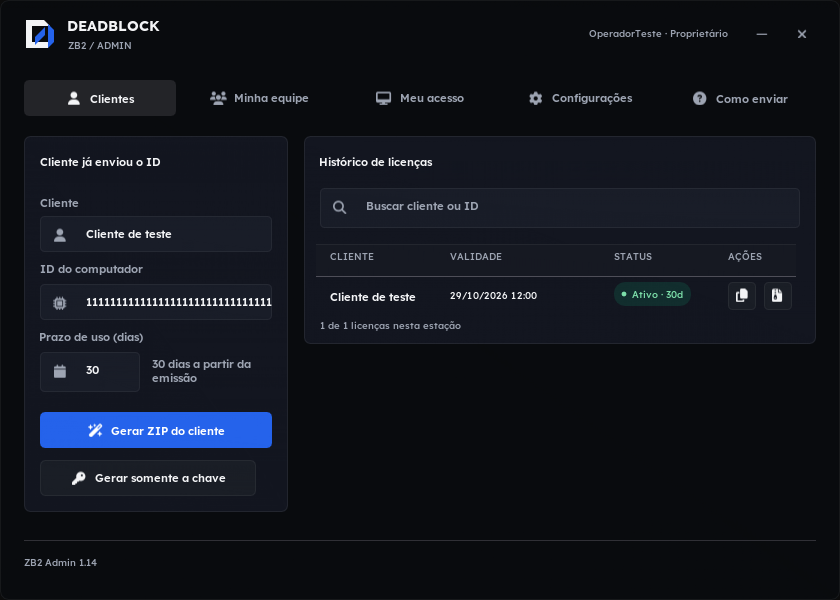
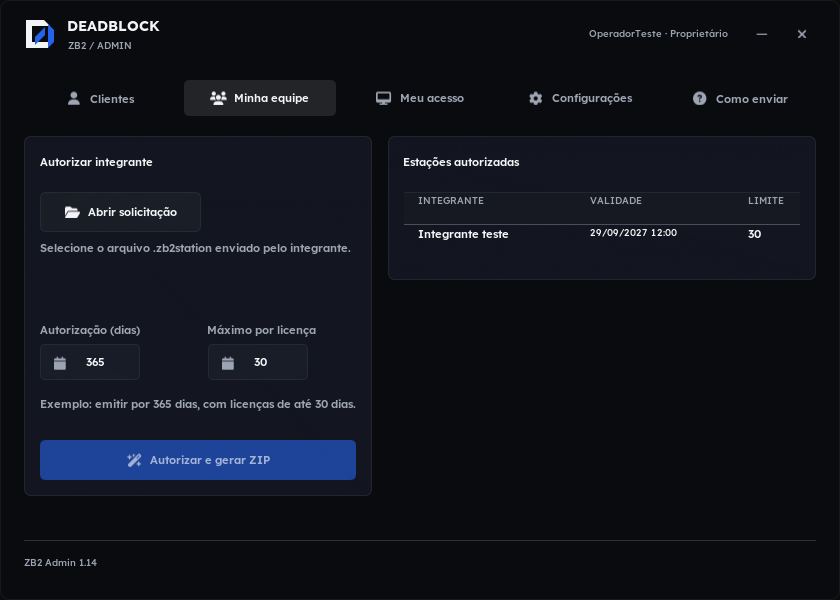
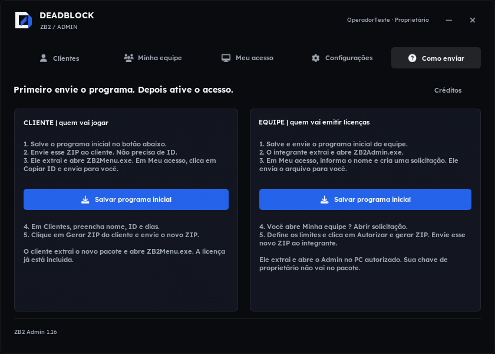
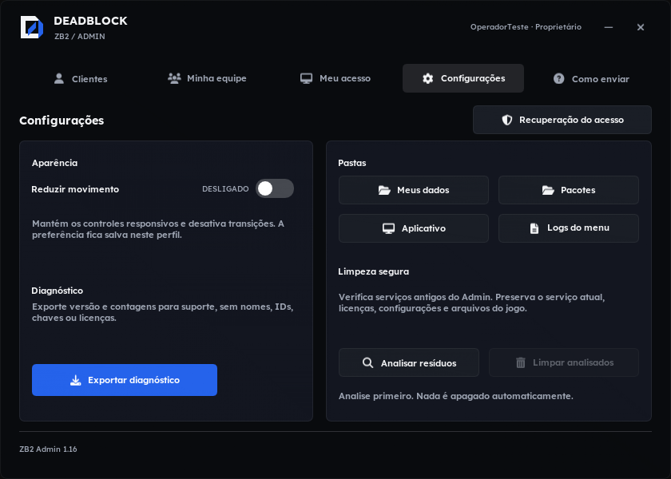
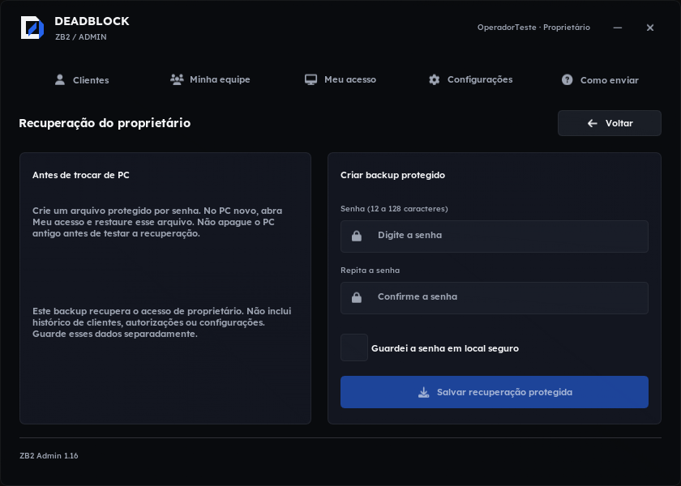

# Prévias do DEADBLOCK

Estas imagens são geradas pelo código real da interface, com perfis e estados
sintéticos. Não são capturas de uma partida nem prova de funcionamento de cada
controle. Não contêm dados de clientes, ID real do computador ou licença pessoal.

## Menu nativo

Interface do menu compilada a partir de `src/menu/gui.cpp`, sem conexão com o jogo.
O painel possui rolagem; a imagem apresenta a área inicial da aba PLAYER.

## Cliente

| Ativação | Estado de carregamento confirmado (simulado) |
|---|---|
|  |  |

## Admin

## Atualizar as imagens

1. Compile o loader e o Admin com `--tests`, na ordem indicada em ATUALIZACOES.md.
2. Instale Pillow no ambiente de desenvolvimento (`python -m pip install Pillow`).
3. Execute `python scripts/export_previews.py` na raiz do repositório.
4. Confira visualmente todas as imagens e confirme ausência de dados pessoais.
5. Execute `python scripts/export_previews.py --check`.
6. Inclua PNGs e `docs/previews/manifest.json` no mesmo commit da mudança visual.

O script compila um renderizador do menu e executa os testes de UI em uma pasta
temporária dentro de `build/previews`. Os intermediários dessa execução são removidos
ao terminar; somente o log técnico permanece em build. Não controla mouse/teclado
do usuário, não abre o jogo, não lê perfis reais e não faz upload de imagens.

O manifesto guarda hashes dos fontes, imagens e executáveis de teste usados. A
verificação de CI rejeita prévias antigas quando os fontes cobertos mudarem.
Ela não substitui a conferência visual nem verifica automaticamente se um binário
de teste fornecido manualmente foi recompilado; use os builds da árvore atual.

## Resultado inicial da automação (01/10/2026)

A verificação local passou e as dez imagens foram revisadas. O workflow está ativo,
mas a primeira execução manual no GitHub encerrou com startup_failure antes de criar
jobs. A API não forneceu diagnóstico específico; não foi demonstrada aprovação do CI.
Até resolver a inicialização, executar --check localmente continua obrigatório.

Execução: https://github.com/OTheMandaloriano/Menu-ZB2/actions/runs/36809876120
